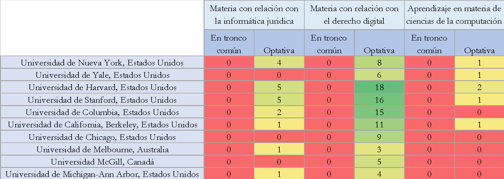
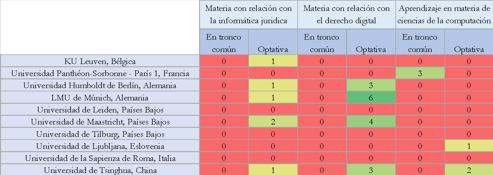
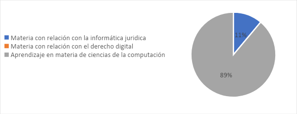
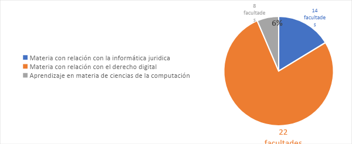
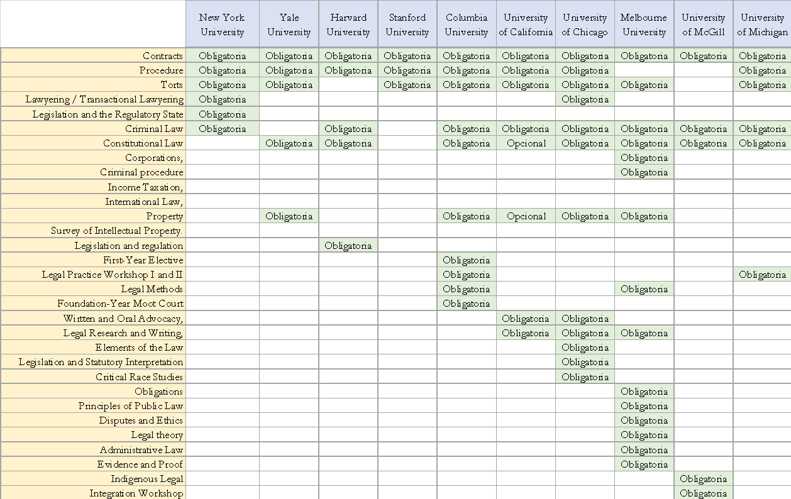

# Metodología detallada de la recolección y análisis de datos para el marco referencial

El marco referencial está enfocado en el estudio de facultades de derecho clasificadas en dos: el _Times Higher Education World University Rankings 2022[\[1\]](#footnote-1)_ y el _QS World University Rankings by Subject 2021_[\[2\]](#footnote-2). Para que el análisis de datos esté lo más representativo posible, lo separamos en tres grupos:

1. **Grupo 1. Mejores facultades de Derecho en el mundo:** Se comparó la oferta académica de las 10 mejores facultades de Derecho en el mundo según el _Times Higher Education World University Rankings 2022_. De los diferentes indicadores, nos interesamos únicamente a la puntuación de la enseñanza (_teaching_) para seleccionar las 10 mejores facultades de derecho.
2. **Grupo 2. Mejores facultades de Derecho en el mundo con tradición de Derecho civil:** Teniendo en cuenta que el sistema jurídico mexicano es con tradición de Derecho civil, y dado que las 10 facultades mejor clasificadas que se han analizado se encuentran todas en países de derecho anglosajón, realizamos nuevamente el análisis centrándonos únicamente en las mejores facultades de derecho del _Times Higher Education World University Rankings 2022_ en los países con tradición de derecho civil.
3. **Grupo 3. Mejores facultades de Derecho en países de América Latina:** Para cumplir plenamente con el objetivo de coherencia, analizamos las facultades más prestigiosas de América Latina, países en los que tanto la práctica jurídica como la capacitación preuniversitaria son particularmente cercanas. Puesto que la clasificación del _Times Higher Education World University Rankings 2022_ solamente mencionaba 8 universidades en América Latina, usamos la clasificación del _QS World University Rankings by Subject 2021: Law & Legal Studies_. A diferencia de la primera, dicha clasificación se basa en la reputación académica y el impacto de la investigación. Puesto que la evaluación comparativa se enriquece particularmente con la exploración de las universidades de América Latina, decidimos aumentar el número de universidades comparadas y explorar las asignaturas de las 15 primeras universidades de América Latina mencionadas en el QS World University Rankings para la materia “Derecho”.

Dentro de cada grupo, se buscó identificar las asignaturas obligatorias y optativas que tengan relación con el mundo digital, dividiéndolas entre los temas que describimos a continuación:

- _Informática jurídica_, definida como “el estudio de la estructura y las propiedades de la información, así como la aplicación de la tecnología a la organización, el almacenamiento, la recuperación y la difusión de la información.”[\[3\]](#footnote-3)
- _Derecho y tecnología_, lo cual implica el estudio de las fuentes jurídicas aplicables a las actividades que implican recursos informáticos (privacidad de datos, propiedad intelectual y mundo digital, software, paquetes de software, aplicaciones, hardware, sistemas de información o cualquier otra herramienta informática, plataformas digitales, etc.)[\[4\]](#footnote-4)
- _Aprendizaje en materia de ciencia de la computación_ o _Alfabetización digital_, lo cual implica la capacitación en informática y/o estadísticas, en su caso con un enfoque en ciencias sociales[\[5\]](#footnote-5). Incluimos también en este rubro toda capacitación en matemática para juristas.

Los datos completos están a disposición [aquí](https://github.com/PhilippeWhaat/universities_curriculum_lawyers/blob/main/collected_data.xlsx).

## Mejores facultades de Derecho en el mundo

En cada una de las mejores facultades de Derecho en el mundo identificamos los cursos de _Juris Doctor Degree_ que están directamente relacionados con el derecho informático, la informática jurídica o la capacitación en ciencias de la computación y estadísticas basándonos en el título de la asignatura

Debido a la cantidad de cursos que puede llegar a más de 800 en ciertas facultades de Derecho, se diferenciaron las asignaturas gracias a búsquedas automáticas en las listas con las siguientes palabras claves:

Algorithm;

Analytics;

Analytical;

Artificial;

Blockchain;

Computer;

Computing;

Cyber;

Data;

Digital;

Fintech;

Hardware;

Informatics;

Information;

Internet;

Math;

Media;

Metrics;

Modern;

Net;

Online;

Platforms;

Privacy;

Program;

Software;

Statistics;

Statistical;

Systems;

Tech;

Technology;

Telecom;

Virtual;

## Mejores facultades de Derecho en países con tradición de Derecho civil

Para este grupo, debido a la cantidad menor de cursos propuestos y los diferentes idiomas en los cuáles proponen su oferta (francés, alemán, neerlandés, italiano, chino o esloveno), hicimos una revisión manual y recurrimos a herramientas de traducción automática para poder ubicar los cursos propuestos por dichas universidades cuando no teníamos una persona que domina el idioma en cuestión.

## Mejores facultades de derecho en países de América Latina

Recurrimos al mismo método que para el grupo anterior, usando traducción automática para disipar incertidumbre acerca de los programas en portugués propuestos por facultades en Brasil.

## Metodología para la construcción del marco referencial

Teniendo en cuenta el contexto y las distintas facetas del objetivo así planteado, construimos un marco referencial contestando a cuatro preguntas claves:

1. ¿Qué asignaturas relacionadas con el mundo digital ofrecen las facultades de Derecho más prestigiosas en el mundo en sus programas de licenciatura en Derecho?
2. ¿Cómo se reparten las asignaturas relacionadas con el mundo digital entre el plan de estudios básico y las optativas?
3. ¿Existen diferencias en la enseñanza del derecho digital y la informática jurídica entre las facultades de derecho de tradición civilista y las de tradición anglosajona?
4. ¿Cómo se comparan los programas de licenciatura en Derecho de América Latina con los del resto del mundo en cuanto a la oferta de asignaturas relacionadas con lo digital y la ingeniería?

Así pues, no limitamos nuestro estudio a la informática jurídica y al derecho digital, sino también examinar la oferta en las carreras de Derecho de materias tradicionalmente pertenecientes al campo de la ingeniería.

Además, resulta importante la distinción entre las tradiciones de Derecho civil y de Derecho anglosajón en la educación jurídica. Son dos enfoques distintos tanto en la educación como en la práctica jurídicas.

- Los países de tradición jurídica civil, como los de América Latina, hacen hincapié en la importancia de los códigos y los estatutos en la educación y la práctica jurídicas. Además, proponen generalmente un catálogo de materias reducido, con la mayoría de las materias formando parte de un tronco común.
- Los países de tradición jurídica anglosajona, como los Estados Unidos y el Reino Unido, hacen más hincapié en las decisiones judiciales y la jurisprudencia. Además, el estudiante en éstas facultades tiene mayor flexibilidad para elegir el contenido de su capacitación: las materias obligatorias son reducidas para que el estudiante componga con mayor libertad el “perfil de interés” único y peculiar que tendrá al final de su carrera.

Esta diferencia de enfoque podría tener implicaciones significativas para la enseñanza del derecho digital y la informática jurídica, ya que el desarrollo y la aplicación de la tecnología en la práctica jurídica pueden variar entre las jurisdicciones de derecho civil y las de common law.

Precisamos que nuestro estudio tiene un enfoque mundial, con particular énfasis en la región de América Latina, por las razones a continuación.

- Primero, el campo de la informática jurídica y del derecho digital es un ámbito de estudio en rápida evolución y cada vez más globalizado, en el que la tecnología permite que el ejercicio de la abogacía trascienda las fronteras nacionales. Como tal, es importante entender cómo la educación jurídica y la enseñanza del derecho digital y la informática jurídica están evolucionando en diferentes regiones del mundo para garantizar que los licenciados en Derecho estén equipados con los conocimientos y habilidades necesarios para navegar por este panorama jurídico globalizado.
- Segundo, un enfoque global es importante porque el sector jurídico es cada vez más diverso y multicultural. Los licenciados en Derecho pueden encontrarse trabajando en diferentes partes del mundo y, por lo tanto, es importante que su educación refleje esta realidad. Esto es particularmente importante para América Latina, que se ha convertido en una región cada vez más importante para los negocios y el comercio internacional, por lo que es esencial comprender el panorama de la educación jurídica en esta región.
- Por último, centrarse en la región de América Latina es importante porque se trata de una región en rápido desarrollo con un importante potencial de crecimiento en el sector jurídico. Comprender el estado de la educación jurídica y la enseñanza del derecho digital y la informática jurídica en América Latina puede proporcionar valiosas ideas sobre cómo se puede mejorar la educación jurídica para satisfacer las demandas de la industria jurídica globalizada.

Por las razones antes expuestas, nos referiremos al Times Higher Education World University Rankings y al QS World University Rankings by Subject, dos de los sistemas de clasificación de universidades más prestigiosos y reconocidos a nivel mundial. Utilizan diversos indicadores objetivos, como la reputación académica, la calidad de la investigación y la proporción entre estudiantes y profesores, para evaluar el rendimiento general y la excelencia académica de las universidades. Estas clasificaciones, por su rigor metodológico, se utilizan a menudo como referencia del rendimiento universitario y son útiles para comparar universidades de distintas regiones y países.

## Revisión de planes de estudio de derecho

Para dar respuesta a la pregunta ¿qué asignaturas relacionadas con el mundo digital ofrecen las facultades de Derecho más prestigiosas en el mundo en sus programas de licenciatura en Derecho?, la metodología seguida permitió llegar a un resultado para el primer grupo (facultades de Derecho más prestigiosas en el mundo):

1. Universidad de Nueva York, Estados Unidos
2. Universidad de Yale, Estados Unidos
3. Universidad de Harvard, Estados Unidos
4. Universidad de Stanford, Estados Unidos
5. Universidad de Columbia, Estados Unidos
6. Universidad de California, Berkeley, Estados Unidos
7. Universidad de Chicago, Estados Unidos
8. Universidad de Melbourne, Australia
9. Universidad McGill, Canadá
10. Universidad de Michigan-Ann Arbor, Estados Unidos

Por regla general, varias de las mejores facultades de Derecho en el mundo hacen hincapié en la enseñanza del derecho digital. Por ejemplo, la Universidad de Harvard diseñó un programa de estudio especial para Derecho y tecnología llamado _Law, Science, and Technology[\[6\]](#footnote-6)_. Este programa de estudios se centra en temas orientados a la tecnología, como propiedad intelectual, tecnología y libertades civiles y derecho de Internet. La Universidad de Chicago tiene también un programa de estudios similares. Otro ejemplo es la Columbia Law School que tiene un área de estudio especialmente orientado a Análisis de Datos, otra a Seguridad Nacional y Privacidad y finalmente una que se interesa a Propiedad Intelectual y Tecnología[\[7\]](#footnote-7).

Más allá del Derecho digital, también varias facultades incluyeron cursos especialmente orientados a la informática jurídica y la capacitación de los juristas en ciencias de la computación o estadísticas:

- La Universidad de Stanford propone cursos tales como _Statistical Inference in Law_, _Judging in the 21st Century_ o _Policy Practicum: Unlocking Technology to Promote Access to Justice_;
- La Universidad de Havard por su lado propone asignaturas como _Fundamentals of Statistical Analysis_ o _Access to Justice in the Digital World_
- La Universidad de Nueva York propone seminarios tales como _Quantitative Methods_ y un curso de dos niveles de _Global Data Law_.

La lista de materias electivas puede llegar a ser muy variada. Reproduciremos únicamente el ejemplo de la Universidad de Havard, misma que tiene la oferta académica en relación con nuestro tema de estudio con mayor diversidad y volumen:

- Computer Science for Lawyers (CS50 for Lawyers);
- Writing Group: Artificial Intelligence and the Just Society;
- Digital Governance: Privacy and Technology Trade-Offs;
- Algorithms, Rights, and Responsibilities;
- Property in the Age of Artificial Intelligence; Cyber Criminal Law and Procedure;
- Legal Problems in Cybersecurity and Cyber Conflict; Fundamentals of Statistical Analysis;
- Youth, Privacy, and Digital Citizenship;
- Cyberlaw Clinic;
- Cyberlaw Clinic Seminar;
- Access to Justice in the Digital World;
- Designing a Central Bank Digital Currency for the United States;
- EU Tech Regulation; Mass Media Law;
- Analytical Methods for Lawyers;
- Technology and the Public Interest;
- The Craft of Lawyering;
- Communications and Internet Law and Policy;
- Music and digital media;
- Media Images & The Law: Contesting Media in the Modern Era;
- Entertainment and Media Law: Entertainment Transactions and Negotiations;
- Communication, Law and Social Justice;
- City Use of Technology;
- Legal Profession - The New Market for Personal Legal Services: Ethical and Professional Challenges

## Repartición de las asignaturas relacionadas con el mundo digital entre el plan de estudios básico y las optativas

La oferta académica para materias electivas que tengan relación con Derecho y tecnología es mucho más amplia en las facultades de Derecho del grupo 1 que en los dos otros grupos. Constituye un porcentaje importante de las materias propuestas.

_Figura 1 - Mapa de calor de las materias relacionadas con la tecnología en las mejores facultades de derecho del mundo (según el Times Higher Education World University Rankings 2022)_

Puesto que el estudiante empieza a elegir materias muy temprano en su carrera, es probable que la resultante de esta observación sea que tenga una sólida capacitación sobre temas de informática jurídica o de Derecho digital, a pesar de que dicha no sea obligatoria.

Al fin y al cabo, el análisis revela que, si bien el tronco común no incluye materias obligatorias que juntan Derecho y tecnología, las mejores facultades del mundo diseñan su oferta de tal manera que el estudiante se enfrentará muy probablemente con la tecnología en su trayectoria de licenciatura en Derecho, pues la oferta académica en la materia es diversa y amplia.

En el caso de las facultades del grupo 2 (Mejores facultades de Derecho en países con tradición de Derecho civil), se observa que las asignaturas troncales no incluyen una mezcla entre la ciencia jurídica y la tecnología. La única excepción es la Universidad de la Sorbona, que exige a sus estudiantes una “Certificación PIX” para acreditar un nivel básico en ciencias computacionales. Sin embargo, se trata de dar al estudiante una comprensión básica de cómo utilizar los programas ofimáticos. En este sentido, la modalidad curricular se centra en la apropiación de recursos informáticos sin llegar a una transformación digital de la práctica jurídica ni de la comprensión del fenómeno digital para dar asesoría o litigar en este sector (Arancibia, 2001).

_Figura 2 - Mapa de calor de las materias relacionadas con la tecnología en las mejores facultades de derecho en países con tradición de derecho civil (según el Times Higher Education World University Rankings 2022)_

En el caso de la Universidad de Leiden, Países Bajos, el programa completo no está disponible en línea, y tampoco se puede solicitar a través del formulario previsto. Sin embargo, de toda la información que aparece en la página web y en las fuentes que detallan los programas de primer año, ninguna indica que se imparten las materias que estamos investigando. Si este fuera el caso de que no se enseña, podríamos mencionar que hasta que no egresan lo aprenden sobre la marcha, de forma empírica, en el mundo laboral, sin considerar “las nuevas tendencias \[del Derecho\], por ejemplo (...) realizar investigación jurídico informático de Internet y aplicar las Tics, entre otras” (Aguilar, 2020, p. 51).

Hemos observado que, aunque la oferta académica es menor en cuanto al volumen de asignaturas optativas que mezclan Derecho y tecnología, sigue siendo muy probable que el estudiante de derecho incluya en su currículo una formación en Derecho informático, informática jurídica o informática pura. En efecto, la proporción entre las optativas de la licenciatura jurídica clásica y las de Derecho y tecnología es similar a la de las facultades anglosajonas, ya que la oferta global de optativas es también menor.

La estrategia para oferta académica en el grupo 3 (Mejores facultades de Derecho en países de América Latina) es parecida a la del grupo 2: las materias optativas solamente existen para los dos últimos semestres:

_Figura 3 - Mapa de calor de las materias relacionadas con la tecnología en las mejores facultades de derecho en países de América latina (según el QS World University Rankings by Subject 2021). Ciertas universidades tuvieron que ser excluida del análisis y están señaladas con “N/A”._

Destacamos la oferta académica del Tecnológico de Monterrey que tiene como obligatorias las siguientes materias para los estudiantes de derecho:

- Principios de programación para las ciencias sociales
- Herramientas tecnológicas para las ciencias sociales
- Emprendimiento y tecnología para la transformación de México

Al analizar todo el conjunto de datos observamos que, de las 38 facultades analizadas, sólo 4 han tomado la iniciativa de incluir asignaturas relacionadas con el mundo digital en su plan de estudios obligatorio de Derecho, lo que representa un poco más del 10%. Esta baja cifra sugiere que la oferta está lejos de estar saturada, lo que significa la presencia de una oportunidad, pero no podemos concluir por qué el porcentaje es tan bajo.

Dentro de las materias obligatorias relacionadas con el mundo digital, observamos la siguiente repartición:

_Figura 4 - Repartición de la capacitación de tronco común_

Así, para las 4 facultades que proponen una formación básica que incluya una capacitación en materia tecnológica, la gran mayoría de las asignaturas se relacionan con el aprendizaje en materia de ciencia de la computación o alfabetización digital, sin relacionarlo directamente con el Derecho, lo cual sugiere que dichas Facultades sólamente apuntan a dar a sus estudiantes unas habilidades para el manejo de la herramienta informática, sin buscar una transformación de la práctica de los futuros profesionales sino acostumbrarles con un manejo existente de herramientas informáticas en los despachos de abogados, como se puede contrastar en Arancibia (2001), en el sentido de que es la forma más tradicional de incorporar[\[8\]](#footnote-8) la tecnología a la malla curricular. Por lo tanto, los saberes allí involucrados son propios de la disciplina de la informática y no tanto de la aplicabilidad en la práctica jurídica.

Para la única facultad que ha integrado una asignatura en relación con la informática jurídica, se trata una vez más de formar a los estudiantes en informática en lugar de imponerles conocimientos de derecho digital: ninguna facultad ha integrado en su plan de estudios conocimientos obligatorios de derecho digital en forma de una asignatura independiente:

Las cosas son diferentes cuando analizamos las materias optativas:

_Figura 5 - Repartición de la capacitación para materias optativas_

La oferta académica de las facultades de Derecho en cuanto a asignaturas optativas cambia drásticamente, reflejando la voluntad de formar abogados capaces de moverse en un mundo digital para afrontar los litigios relacionados con él. Por ello, la oferta de asignaturas optativas se centra en gran medida en el derecho digital.

Los datos recogidos también muestran que, de las 38 facultades seleccionadas para nuestro estudio y que dan acceso a su catálogo de asignaturas optativas:

- 14 facultades (37%) ofrecen 28 asignaturas de informática jurídica
- 22 facultades (58%) ofrecen 133 asignaturas de derecho digital
- 8 facultades (21%) ofrecen 11 asignaturas de informática y/o estadística

Esta distribución por cabeza y por volumen de asignaturas nos indica que algunas facultades han optado por configurar una oferta académica masivamente orientada a las nuevas tecnologías, mientras que la mayoría de las demás facultades no han emprendido ninguna reforma en este ámbito o muy poco.

Existe, pues, una laguna, que sólo un análisis histórico permitiría examinar, en cuanto a la evolución en el tiempo de las estrategias académicas sobre el tema.

## ¿Existen diferencias en la enseñanza del derecho digital y la informática jurídica entre las facultades de derecho de tradición civilista y las de tradición anglosajona?

Una característica que comparten las mejores facultades de Derecho en el mundo es que, al estar en países con tradición de derecho anglosajón, tienen el siguiente acercamiento para la enseñanza del derecho: En el primer año (y el segundo año para la Universidad de Melbourne), existe una lista de materias obligatorias que todo alumno debe tomar, como requisito (lo que llamaremos “tronco común” en adelante). Después de este periodo, el alumno puede elegir las materias que quiera dentro de la oferta académica de materias opcionales.

Hay pocas diferencias en los nombres que le dan las distintas facultades durante el tronco común. Por regla general, se encuentran como obligatorias las materias _Contracts_, _Procedure_ y _Torts_, y hay diferencias entre las facultades sobre el carácter obligatorio o no de otras materias:

_Figura 6 - Materias obligatorias de las mejores facultades de derecho del mundo (JD program)_

Nuestro análisis de las mejores facultades de Derecho del mundo revela que la oferta académica en tronco común no incluye materias que pongan en relación el Derecho y la tecnología, o que proporcionen al estudiante una capacitación en informática como curso básico obligatorio. Lo anterior podría deberse al hecho de que las materias que suelen definirse emergentes en la enseñanza del Derecho, van presentándose en primera instancia como electivas dentro del currículo formal, hasta que de alguna manera se consideran fundamentales en la formación del abogado al igual que las ya mencionadas _Contracts_, _Procedure_ y _Torts_. En este sentido, las relacionadas con el mundo digital, paulatinamente podrían considerarse básicas u obligatorias en el currículo, ya que siguiendo a Quezada et al., 2022, la tecnología y la realidad están vinculadas en muchos aspectos de la vida humana. De hecho, como afirma Benfeld (2017), dentro de los nuevos paradigmas universitarios hay una propensión en la educación jurídica a crear mayor conciencia sobre la importancia práctica de la formación universitaria, lo cual “ha llevado de manera natural a las universidades a hacerse cargo no solo de entregar una instrucción teórica a sus alumnos sino también un conjunto de competencias y destrezas que les permitan desenvolverse de manera adecuada en el ámbito social y laboral” (p. 589).

Además, cabe destacar que este carácter opcional se extiende en las Facultades analizadas del mundo anglosaxon a otras materias que se encuentran fundamentales, y obligatorias, en los troncos comunes de varias facultades de Derecho en los sistemas de Derecho civil, tales como _Obligations_, _Labor Law_ o _Legal Methodology_. En otras palabras, el tronco común de las facultades en los países de derecho anglosaxon carece de varias asignaturas que pueden ser consideradas como indispensables para el profesional del Derecho. Concluimos que la ausencia de materias que relacionan la ciencia jurídica y tecnología en el tronco común de la oferta académica de dichas facultades no permite deducir que las facultades consideran o no estas materias como indispensables en la capacitación de los profesionistas jurídicos.

Cabe destacar que la oferta académica en los países de Derecho civil difiere de la de los países de Derecho anglosajón. Es menos amplia, puesto que el tronco común se extiende durante varios años. Por regla general, es sólo durante los dos últimos semestres que el estudiante puede elegir materias optativas.

Puesto que la oferta es menor que en las facultades de Derecho de países con tradición jurídica anglosajona, podemos reproducir a continuación la oferta académica de materias optativas que son relevantes para nuestro estudio:

<table><thead><tr><th>
<strong>Universidad</strong>
</th><th>
<strong>Materias optativas con relación con el mundo digital</strong>
</th></tr><tr><th>
KU Leuven, Bélgica
</th><th><ul><li>Informática Jurídica</li></ul></th></tr><tr><th>
Universidad Panthéon-Sorbonne - París 1, Francia
</th><th><ul><li>Ninguna</li></ul></th></tr></thead><tbody><tr><td>
Universidad Humboldt de Berlín, Alemania
</td><td><ul><li>La transformación digital del Estado y la Administración en el derecho alemán y europeo</li><li>Jurisprudencia cuantitativa</li><li>Aspectos jurídicos de la soberanía digital</li><li>Digitalización e Instituciones</li></ul></td></tr><tr><td>
LMU de Múnich, Alemania
</td><td><ul><li>Eventos del Centro de Informática Jurídica</li><li>Conceptos básicos de informática y derecho</li><li>Investigación especializada y bases de datos legales</li><li>Derecho Cibercriminal</li><li>Protección de datos en empress y autoridades</li><li>Cumplimiento en Tecnologías de la Información</li><li>Protección de datos en empress y autoridades</li></ul></td></tr><tr><td>
Universidad de Maastricht, Países Bajos
</td><td><ul><li>Legal Analytics</li><li>Advanced Legal Analytics</li><li>Internet &amp; Law Gouvernance</li><li>Privacy</li><li>Trabajar en el futuro: derecho y tecnología</li><li>Intellectual Property in the Digital Single Market</li></ul></td></tr><tr><td>
Universidad de Ljubljana, Eslovenia
</td><td><ul><li>Métodos estadísticos de investigación en ciencias sociales</li></ul></td></tr><tr><td>
Universidad de Tsinghua, China
</td><td><ul><li>Derecho computacional</li><li>Desarrollo Tecnológico y Civilización Humana</li><li>Ley de Internet y Comercio Electrónico</li><li>Artes liberales Matemáticas</li><li>Redes y Comercio Electrónico</li><li>Ley de Internet y Comercio Electrónico</li></ul></td></tr></tbody></table>

_Figura 7 - Oferta temática derecho y tecnologías en mejores facultades del mundo en países con tradición de derecho civil (según el Times Higher Education World University Rankings 2022)_

En general, la diferencia principal entre las facultades en países de derecho anglosajón y las de derecho civil radica en el abanico de materias ofrecidas en relación con el mundo digital, claramente mayor en las primeras que en las últimas.

## ¿Cómo se comparan los programas de licenciatura en Derecho de América Latina con los del resto del mundo en cuanto a la oferta de asignaturas relacionadas con lo digital y la ingeniería?

Descubrimos al momento de recolectar los datos que la comunicación institucional de las facultades de Derecho del grupo 1 y 2 enfatiza generalmente la oferta de asignaturas relacionadas con el mundo digital. La transformación de la oferta académica se refleja en los elementos de comunicación, que especifican de forma clara y fácilmente accesible para el público la oferta académica, tanto de las asignaturas obligatorias como de las optativas. Además, refleja una importante inversión económica, tanto en recursos humanos destinados a la impartición de estos contenidos como en la investigación fundamental, a veces con una sección entera de la página web académica dedicada a ello. La correlación entre lo anterior y una buena clasificación general en los indicadores de calidad mundial no significa necesariamente que haya una relación causal, pero podría existir o, al menos, podría proporcionar un buen indicador de rendimiento.

Teniendo en cuenta estas consideraciones, cabe señalar que es necesario reconocer la diferencia entre las facultades del grupo 3 (América latina) y las facultades del grupo 1 y 2. La inversión por parte de las universidades latinoamericanas en áreas que relacionan la tecnología y el Derecho parece más baja, tanto en términos de tiempo, dinero y recursos humanos, que las otras universidades analizadas. Si bien existen esfuerzos, no se traducen en una política de comunicación institucional que permita informar públicamente sobre el compromiso de las facultades de derecho con la capacitación de sus estudiantes en derecho y tecnología, ni sobre la asignación de tiempo, dinero y recursos humanos para la investigación y otras actividades académicas, congresuales o no, relacionadas con estas disciplinas. Tan así que, desafortunadamente, no todas las facultades proponían un acceso en línea al programa de sus materias opcionales que pudiera poner de relieve sus esfuerzos en materia de oferta académica relacionada con el mundo digital. Por esta razón, cuatro universidades no pudieron entrar en las estadísticas.

Cabe mencionar también que excluimos dos universidades del análisis cuantitativo. Aunque sus ofertas académicas son innovadoras de un punto de vista cualitativo, no se adapta a la metodología que usamos puesto que los no podíamos clasificar los cursos según la taxonomía empleada para nuestro análisis:

- En la Universidad del Rosario de Colombia, observamos una oferta interdisciplinar que llaman _mención académica_: “Una mención académica, es la oportunidad de tomar un conjunto de asignaturas equivalente a 14 créditos académicos, para profundizar sobre un temática profesional específica.”[\[9\]](#footnote-9) Esta modalidad permite elegir materias muy específicas que corresponden a la mención que el estudiante quiere obtener. El catálogo es muy extenso: identificamos un total de 42 materias para dar cuerpo a esta interdisciplinaridad. El estudiante puede por ejemplo cursar en la facultad de ingeniería materias como Aprendizaje Automático de Máquina, Análisis Estadístico de Datos, Blockchain, Aspectos Legales Para La Innovación, Business Intelligence with Big Data o Desarrollo Ágil De Proyectos Tecnológicos.
- En la Universidad Austral de Argentina, las optativas toman dos modalidades: o un _diploma de extensión_ en el que el estudiante debe cursar más de 150 horas en alguna disciplina de otra carrera; o una _diplomatura en un área de derecho_ en la cual debe cursar 120 horas. En estos dos supuestos podría haber materias que entraran a nuestro estudio, pero la universidad no proporciona que materias pueden ser, solo ejemplos que parecen indicar una autentica posibilidad de que el estudiante se capacite en informática mediante cursos de otras facultades, además del tronco común en Derecho.

Estos análisis permite predecir que ciertas Facultades de Derecho del grupo 3 ven una importancia en una capacitación avanzada de los abogados sobre técnicas computacionales, pues el manejo de ellas permite modernizar la práctica jurídica para que sea basada en datos, pero a diferencia del grupo 1 y 2 no parece que existe una voluntad clara de orientar la práctica jurídica de sus estudiantes hacía el mundo digital.

1. <https://www.timeshighereducation.com/world-university-rankings/2022/world-ranking> [↑](#footnote-ref-1)

2. <https://www.topuniversities.com/university-rankings/university-subject-rankings/2021/law-legal-studies> [↑](#footnote-ref-2)

3. Erdelez, Sanda; O'Hare, Sheila (1997). "Legal Informatics: Application of Information Technology in Law". Annual Review of Information Science and Technology. 32: 367. Traducción libre. [↑](#footnote-ref-3)

4. Dopico P.A.Z. (2022). _Developing an Autonomous and Interdisciplinary Teaching of Cyberlaw in Argentinean Universities_. Journal of Higher Education Theory and Practice, 22 (5) (pp. 104 – 114). North American Business Press [↑](#footnote-ref-4)

5. CALDERA, M.-D., FABA-PÉREZ, C., & GÓMEZ-CRISÓSTOMO, R. (2022). La multiculturalidad y el diseño de planes docentes inclusivos: el caso del Grado en Información y Documentación de la Universidad de Extremadura (España). En Transinformação (Vol. 34). FapUNIFESP (SciELO). <https://doi.org/10.1590/2318-0889202234e210070> [↑](#footnote-ref-5)

6. Harvard Law School. _Academic Offerings, Law, Science and Technology_. Disponible en <https://hls.harvard.edu/dept/academics/programs-of-study/law-science-and-technology/academic-offerings-law-science-and-technology/> [↑](#footnote-ref-6)

7. Columbia Law School. _Areas of Study_. Disponible en <https://www.law.columbia.edu/areas-study> [↑](#footnote-ref-7)

8. Arancibia Herrera, M. (2001). Reflexiones en torno a la aplicabilidad pedagógica de la informática: apuntes para un trabajo transdisciplinario en el currículo escolar.. _Estudios pedagógicos (Valdivia)_, (27), 75-95. <https://dx.doi.org/10.4067/S0718-07052001000100006> [↑](#footnote-ref-8)

9. <https://www.urosario.edu.co/Opciones-academicas/Menciones/?Termino=Jurisprudencia%20(SNIES%201297)&Partido=Interdisciplinar> [↑](#footnote-ref-9)
